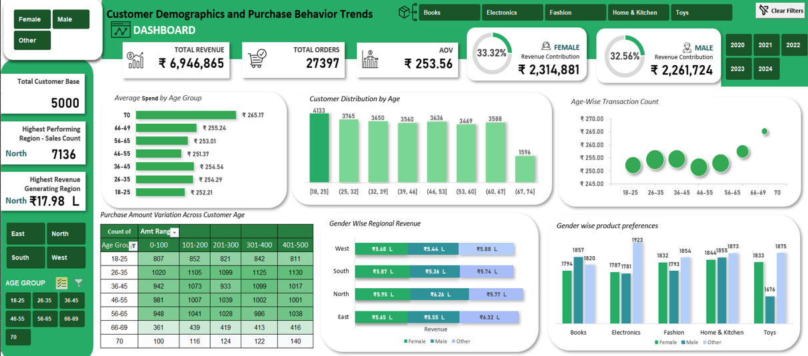
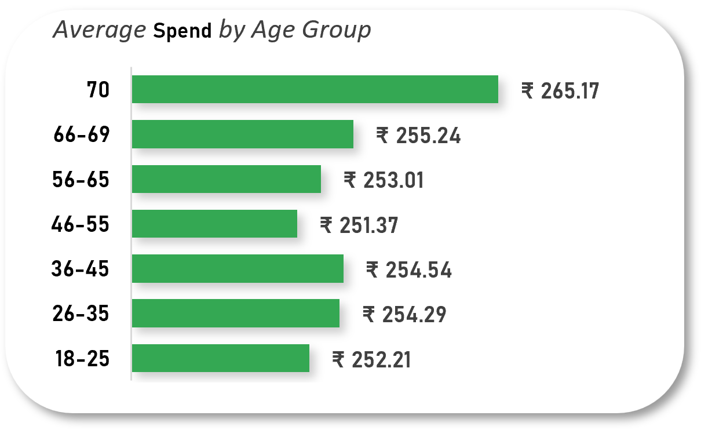
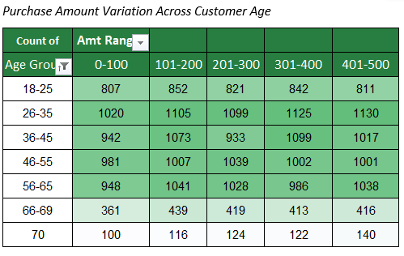
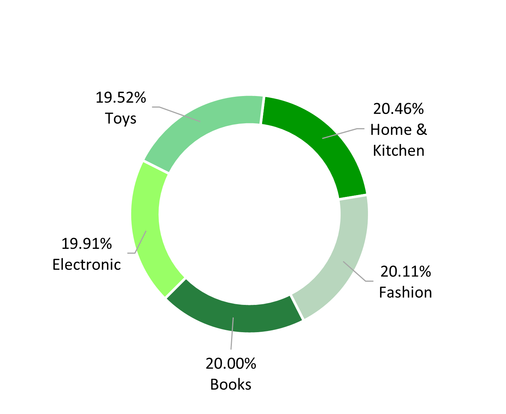

# Customer Demographics & Purchase Behavior Analysis (Excel)

---

## Executive Summary
This project analyzes customer demographics and purchase behavior to understand how different customer segments contribute to business performance beyond surface-level sales metrics. Using Excel-based analytics, Power Query, and an interactive dashboard, the analysis reveals that customer value is not always aligned with purchase frequency. Notably, senior customers (66+) emerge as a high-value but under-engaged segment, while middle-aged customers drive the majority of transaction volume. The findings support a shift toward customer-centric, value-driven decision-making.

#### Dashboard Preview

Below is the interactive Excel dashboard used to explore customer demographics and purchase behavior at multiple levels.

## Business Context / Problem Statement
Organizations often rely on total sales and transaction counts to evaluate performance, which can mask meaningful differences in customer behavior. This project addresses the challenge of identifying **who the customers are**, **how they behave**, and **which segments truly drive value**. The objective is to move beyond sales reporting and uncover actionable insights that enable targeted engagement, retention strategies, and sustainable growth.

## Data Overview & Preparation
The dataset represents anonymized and synthetic customer purchase data containing demographic, transactional, and product-level attributes.

**Key fields include:**
- Customer ID  
- Age and Age Group  
- Gender  
- Region  
- Product Category  
- Purchase Date  
- Purchase Amount  
- Amount Range (binned)

Data preparation was performed using **Power Query** in Excel to:
- Clean and standardize data fields  
- Handle formatting inconsistencies  
- Create derived columns such as Age Group and Amount Range  
- Ensure the dataset was analysis-ready and reproducible  

The prepared dataset served as the single source of truth for all pivot tables, calculations, and visualizations.

## Key Insights

### Senior customers (66+) represent a high-value but under-engaged segment  
Customers aged 66+ contribute the lowest transaction volume but record the highest average purchase value. This indicates that while engagement is limited, spending intensity per purchase is significantly higher, making this segment strategically important for revenue growth through targeted, high-value offerings.  

---

### Middle-aged customers (26–55) form the core transactional customer base  
Customers between the ages of 26 and 55 consistently generate the highest number of purchases across regions and spending ranges. Their stable and frequent purchasing behavior makes them the primary drivers of transaction volume and a critical segment for sustaining steady revenue flow. 

---

### Younger customers (18–25) are highly engaged but exhibit lower spending power  
The 18–25 age group shows high purchase frequency, primarily concentrated within lower purchase value ranges. This reflects price sensitivity and limited disposable income, positioning this segment as a long-term growth opportunity rather than an immediate high-revenue contributor.

---

### Spending behavior is driven more by customer demographics than product categories  
Box plot analysis shows similar median purchase values and comparable variability across all product categories. This suggests that differences in spending are influenced more by customer characteristics than by the type of product purchased. 

---

### Revenue contribution is evenly distributed across product categories  
Each product category contributes a similar share of total revenue, with no single category dominating overall performance. This indicates a diversified product portfolio and reduces dependency on any one category for revenue generation. 

---

### Customer distribution is balanced across regions  
Regional analysis shows a relatively even distribution of customers across North, East, West, and South regions. While minor variations exist, no region significantly dominates the customer base, indicating broad and balanced market penetration.

---

### Gender-wise revenue contribution shows no significant concentration  
Revenue contribution across genders is closely balanced, suggesting that purchasing behavior and value generation are not heavily skewed toward a single gender segment. This reduces reliance on gender-specific demand patterns.

---

### Purchase trends fluctuate over time rather than showing sustained growth  
Monthly purchase trends display periodic increases and declines without a consistent upward trajectory. This pattern suggests that purchasing activity is influenced by seasonal or campaign-driven factors rather than organic growth.

---

### High transaction volume does not necessarily translate into high revenue contribution  
Cross-analysis of transaction counts and average spending reveals that some customer segments generate higher revenue with fewer purchases. This highlights the importance of evaluating customer value using both frequency- and value-based metrics rather than transaction volume alone.

## Strategic Recommendations
- Develop **premium and curated offerings** tailored to senior customers to increase engagement without relying on frequency.
- Strengthen **retention and loyalty programs** for middle-aged customers who form the transactional backbone.
- Introduce **bundling and upselling strategies** for younger customers to gradually improve average order value.
- Shift from product-centric strategies to **customer-centric segmentation** for personalization and targeting.
- Align campaigns with **seasonal demand patterns** rather than assuming organic growth trends.

## Tools & Technologies
- Microsoft Excel  
- Power Query (data cleaning and transformation)  
- Pivot Tables and Pivot Charts  
- KPI Cards  
- VBA (Clear Filters functionality)

## Key Outcomes
- Built an interactive Excel dashboard with **15+ visualizations**, **5–6 KPIs**, and dynamic filters  
- Identified high-value customer segments not visible through transaction volume alone  
- Demonstrated a full analytics workflow: data preparation → analysis → insight generation → business recommendation  
- Created a reusable customer-centric analysis framework in Excel

## Next Steps
- Extend analysis to estimate **Customer Lifetime Value (CLV)**
- Integrate campaign or promotion data to measure segment-level impact
- Build a separate **Sales Performance Analysis** dashboard using the same dataset
- Automate data refresh using Power Query with external sources

## Closing Note
This project demonstrates how structured Excel analytics and thoughtful customer segmentation can uncover insights beyond traditional sales reporting. By focusing on behavior and value rather than volume alone, the analysis highlights opportunities for more targeted, sustainable, and data-driven decision-making.

 

## Author
**Fazmina Ahamed**  
Data Analyst  

